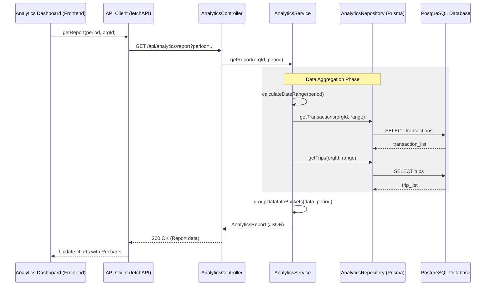

# Analytics Generation Sequence

This diagram details the flow of data through the system when a user requests a periodical analytics report.

```mermaid
sequenceDiagram
    participant UI as Analytics Dashboard (Frontend)
    participant API as API Client (fetchAPI)
    participant Ctrl as AnalyticsController
    participant Svc as AnalyticsService
    participant Repo as AnalyticsRepository (Prisma)
    participant DB as PostgreSQL Database

    UI->>API: getReport(period, orgId)
    API->>Ctrl: GET /api/analytics/report?period=...
    Ctrl->>Svc: getReport(orgId, period)
    
    rect rgb(240, 240, 240)
        Note over Svc, Repo: Data Aggregation Phase
        Svc->>Svc: calculateDateRange(period)
        Svc->>Repo: getTransactions(orgId, range)
        Repo->>DB: SELECT transactions
        DB-->>Repo: transaction_list
        Svc->>Repo: getTrips(orgId, range)
        Repo->>DB: SELECT trips
        DB-->>Repo: trip_list
    end

    Svc->>Svc: groupDataIntoBuckets(data, period)
    Svc-->>Ctrl: AnalyticsReport (JSON)
    Ctrl-->>API: 200 OK (Report data)
    API-->>UI: Update charts with Recharts
```
