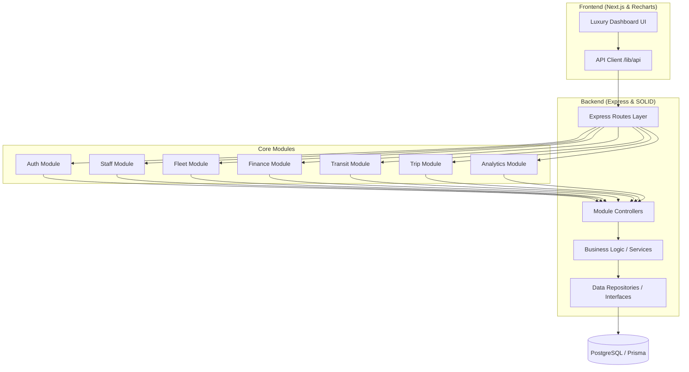

# FleetOS System Architecture (Updated)

This diagram illustrates the current modular architecture of FleetOS, highlighting the decoupled service layers and the centralized data persistence via Prisma.

## Legacy Architecture

