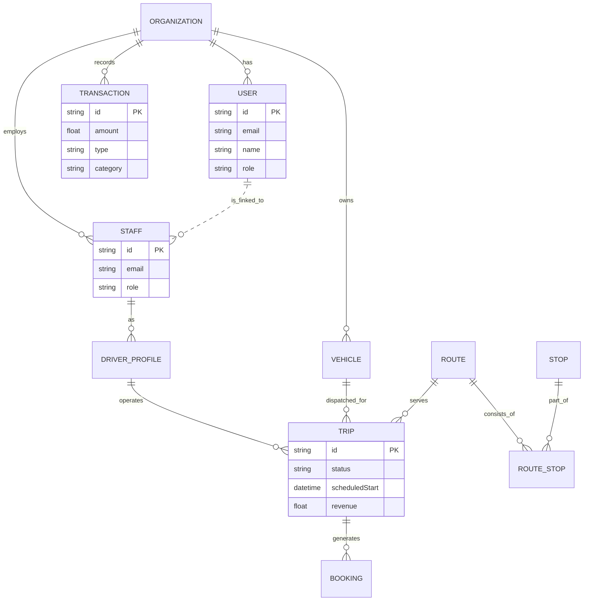

# FleetOS Entity Relationship Diagram (Updated)

This diagram reflects the current database schema, including the new relationships established for Analytics and Route Management.

## Legacy ER Diagram

