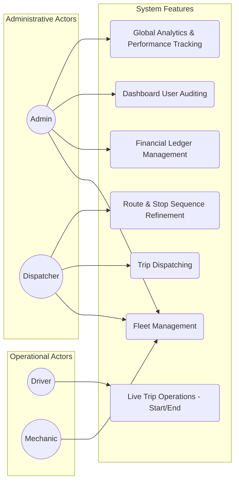

# FleetOS Use Case Diagrams (Updated)

This diagram outlines the primary interactions available to various actors in the system, now including advanced analytics and route refinement.

## Legacy Use Cases

