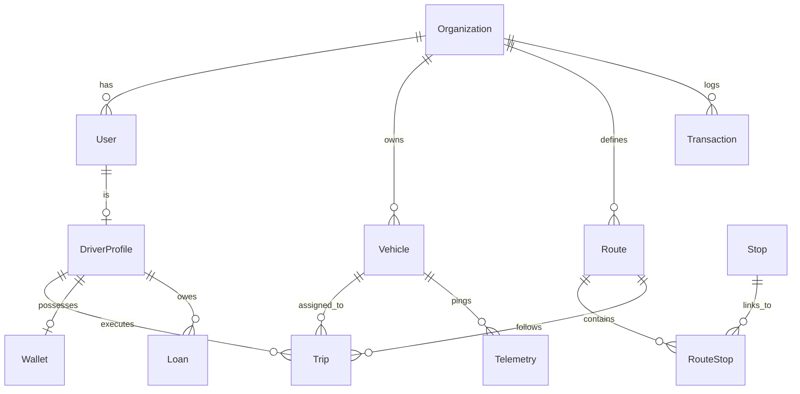
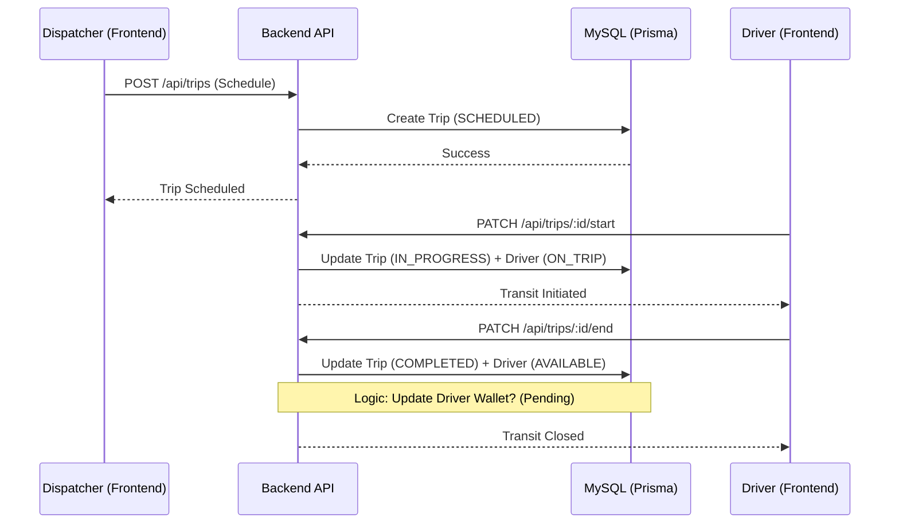
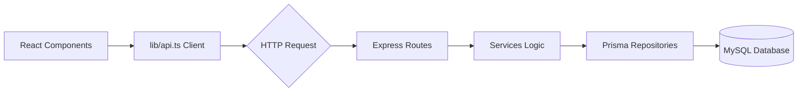

# 📊 System Architecture Diagrams

These charts show how the current version of FleetOS is built and how data flows through the system.

## 1. Database Relationship Map (ER Diagram)
This shows how different things (Users, Buses, Trips) are connected to each other.

## 2. Trip Lifecycle (Logic Flow)
This shows the step-by-step process of a Dispatcher starting a trip and a Driver finishing it.

## 3. Data Flow (Frontend to Backend)
This shows how your buttons talk to the server.

